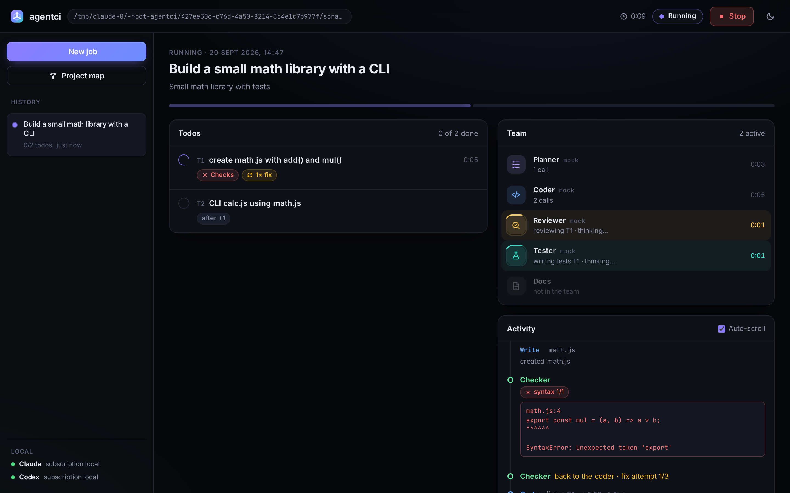
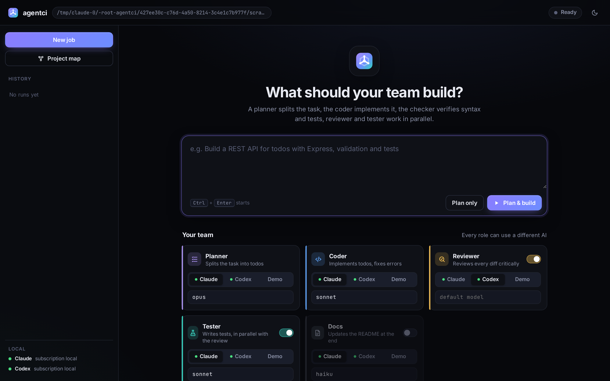
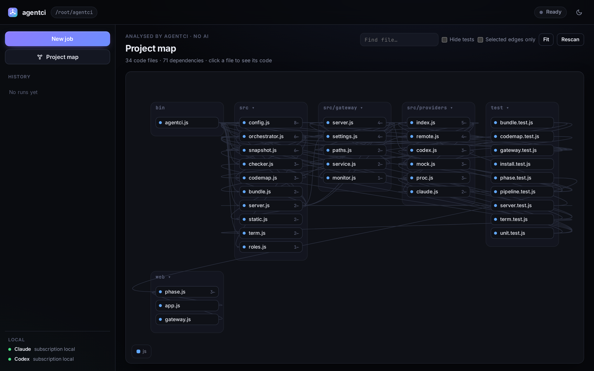
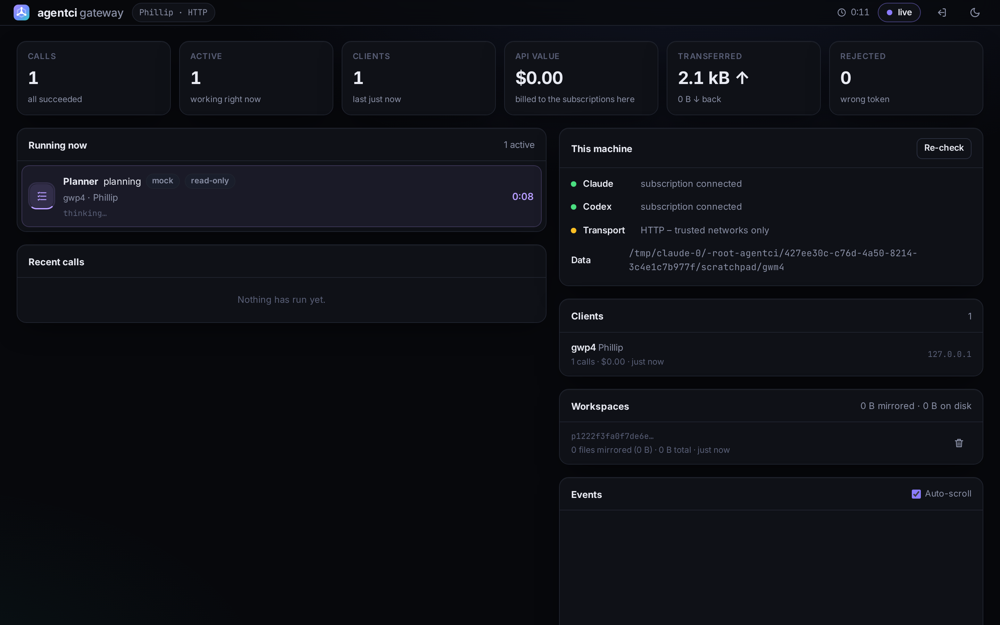

# agentci

**A team of AI agents that build, check, test and review your code – driven by the Claude and ChatGPT subscriptions you already pay for. No API keys.**

One agent plans, one writes code, one reviews the diff, one writes tests, and a plain non-AI checker verifies syntax and runs your test suite. Everything runs locally: a terminal UI, a web UI, and an optional gateway so machines without internet can use the agents too.

```bash
git clone https://github.com/pfurpass/agentci.git && cd agentci
bash install.sh          # installs agentci globally, checks Node, Claude Code and Codex
agentci demo             # free offline demo – no AI calls, no tokens spent
cd your-project && agentci ui
```



---

## Why another coding agent?

| | |
|---|---|
| **Runs on subscriptions** | Drives the `claude` and `codex` CLIs you are already logged into. Nothing is billed per token to an API key. |
| **Different AIs, different jobs** | The coder and the reviewer can be different models – a second model finds what the first one missed. |
| **Verification without AI** | Syntax checks and your real test suite decide whether a todo is done, not an LLM's opinion. |
| **No blind trust** | An agent that changes no file, writes no test, or never gets reviewed is reported as such – never as a green checkmark. |
| **Works without internet** | Machines with no internet access reach the models through your own gateway. |
| **Zero dependencies** | Plain Node.js ≥ 20. `npm install` pulls nothing. |

## How a run works

```
             ┌──────────┐
   task ───▶ │ Planner  │  splits the work into todos (with dependencies)
             └────┬─────┘
                  ▼   for every todo:
             ┌──────────┐     ┌───────────┐  red  ┌────────────┐
             │  Coder   │ ──▶ │  Checker  │ ────▶ │ Coder fixes│ ─┐
             └──────────┘     │ syntax +  │ ◀──────────────────────┘
                              │ tests     │  green
                              └────┬──────┘
                    ┌──────────────┴──────────────┐   (in parallel)
                    ▼                             ▼
              ┌──────────┐                  ┌──────────┐
              │ Reviewer │                  │  Tester  │  writes tests → Checker
              └────┬─────┘                  └──────────┘
        rejected   │→ Coder fixes → Checker → review again
                   ▼
               ● done  → next todo …  → (optional) Docs agent
```

| Role | Default AI | What it does |
|------|-----------|--------------|
| planner | Claude Opus | reads the project (read-only) and writes the todo list |
| coder | Claude Sonnet | implements one todo, fixes what the checker or reviewer finds |
| checker | **no AI** | syntax of every changed file + the project's test suite |
| reviewer | Codex (ChatGPT) | critical review of the diff, read-only, blocks on critical/major issues |
| tester | Claude Sonnet | writes tests, in parallel with the review |
| docs | Claude Haiku (off) | updates the README at the end |

Terminal output – the deliberate syntax error from `agentci demo`, the fix loop, the result:

```
╭──────────────────────────────────────────────────────────────────────────────╮
│ ◆ agentci  Multi-Agent Coding                                                │
│                                                                              │
│ Task      Build a small math library with a CLI                              │
│ Team      ● planner claude:opus  ● coder claude:sonnet  ● reviewer codex     │
╰──────────────────────────────────────────────────────────────────────────────╯

━━ T1  create math.js with add() and mul() ━━━━━━━━━━━━━━━━━━━━━━━━━━━━━ 1/2 ━━
[CODE]    ▸ implementing  claude:sonnet
          │ ✎ Write  math.js
          ╰ ✓ 0:12 · 1 action · $0.04
[CHECK]   ✗ syntax 1/1
          ┃ math.js:4  SyntaxError: Unexpected token 'export'
[CHECK]   ↻ back to the coder · fix attempt 1/3
[CODE]    ▸ fixing  claude:sonnet
          ╰ ✓ 0:08 · 1 action
[CHECK]   ✓ syntax · 2 files   ✓ node --test
[REVIEW]  ✓ approved  Implementation matches the todo
          ● done  0:45 · 1 fix · 2 files
```

A live footer shows every working agent with a spinner and elapsed time. **Ctrl+C** stops cleanly; `agentci resume` picks up where it left off.

## Install

Node 20+ is the only requirement. The installer checks it and prints the right command for your distro.

```bash
bash install.sh                 # install + self-test
bash install.sh --dry-run       # show what would happen, change nothing
bash install.sh --yes           # no questions
bash install.sh --uninstall
```

Sign in once – this is what agentci uses, your subscriptions, not API keys:

```bash
claude          # then /login
codex login     # "Sign in with ChatGPT"
agentci doctor  # verifies installs, logins and gateway
```

<details>
<summary><b>Distro notes (Fedora, Oracle/RHEL, Debian/Ubuntu, macOS)</b></summary>

agentci itself is plain Node – no Docker, no compiler, no system packages.

| System | Node |
|--------|------|
| Fedora 40+ | `sudo dnf install -y nodejs npm` → Node 22, works out of the box |
| Oracle Linux / RHEL / Rocky / Alma 9 | the default `nodejs` module is **16 – too old**: `sudo dnf module enable -y nodejs:22 && sudo dnf install -y nodejs npm` |
| Debian / Ubuntu | `sudo apt install -y nodejs npm`, or nodejs.org when the distro version is < 20 |
| macOS | `brew install node` |

Verified end to end in clean Fedora 44 and Oracle Linux 9 environments: install, `agentci demo`, `agentci doctor`. On Oracle the installer stops with the exact `dnf module enable` command instead of failing later.
</details>

## Use it

```bash
agentci run "Add pagination to the todo API and test it"
agentci plan "Refactor auth.js to async/await"   # plan only …
agentci ui                                        # … edit the todos in the browser …
agentci resume                                    # … then run it

agentci status        # todo list
agentci check         # syntax + tests only, no AI
agentci demo          # offline demo
```

Swap the AI per role, per run:

```bash
agentci run --coder codex --reviewer claude:opus "…"   # ChatGPT codes, Claude reviews
agentci run --planner claude:haiku --no-tests "…"      # cheap and quick
agentci run --docs "…"                                  # enable the docs agent
```

## Web interface

```bash
agentci ui                                  # http://localhost:4317
agentci ui --host 0.0.0.0                   # reachable on the network, prints a token
agentci ui --cert cert.pem --key key.pem    # serve HTTPS directly (same flags as the gateway)
```



- **Start a job** and pick the AI per role; toggle reviewer, tester and docs. "Save as default" writes `agentci.config.json`.
- **Live view**: progress per todo, status chips (checks, fix attempts, review, files), which agent is working right now with elapsed time and current action, and a timeline with every tool call, every failing check and every review issue.
- **Switch the project folder** from the top bar: recently used folders (marked when they already have agentci history), a path field and a small folder browser. History, plan and config live in that folder's `.agentci/`, so switching brings the matching history back. `--lock-dir` pins the folder.
- **Diff viewer** per todo, **history** of all previous runs, stop and resume.
- Dark and light theme, works on a phone.
- Served on `localhost` only unless you pass `--host`; then a token is required for every piece of data (kept in `~/.config/agentci/ui-token`). On untrusted networks use `--cert`/`--key` for HTTPS, or an SSH tunnel: `ssh -L 4317:localhost:4317 user@server`.

#### Behind a reverse proxy / your own domain

agentci only answers to host names it knows – that is what stops DNS-rebinding attacks from a browser. When nginx, Caddy or a Cloudflare tunnel forwards a public name to it, allow that name explicitly (a token is required, because the interface is then effectively public):

```bash
agentci ui --allow-host agentci.example.com
# several names: --allow-host a.example.com --allow-host b.example.com
# or: AGENTCI_ALLOWED_HOSTS=agentci.example.com agentci ui
```

Otherwise you get `host not allowed: agentci.example.com` – the message contains the exact flag to add. The proxy must not buffer, or the live view stalls:

```nginx
location / {
    proxy_pass http://127.0.0.1:4317;
    proxy_http_version 1.1;
    proxy_set_header Host $host;
    proxy_buffering off;       # required for the live event stream
    proxy_read_timeout 1h;     # agent calls can take minutes
}
```

### Attachments: paste a screenshot, drop a spec

Press <kbd>Ctrl</kbd>+<kbd>V</kbd> in the task field to paste a screenshot, drag files onto it, or use **Attach**. The files are stored in the project under `.agentci/attachments/` and **every agent gets their paths in its prompt**, so the planner, coder, reviewer and tester can open them. Codex additionally receives images as real image input; Claude reads them with its own Read tool (images and PDFs included).

```bash
agentci run --attach design.png --attach spec.md "Rebuild the settings page to match the design"
```

Your draft survives: task text and attachments are kept when you look something up in another view, when you reload the page, and when you switch the project folder – the attachments are copied into the new folder with you. Starting a run clears the composer.

Verified with a real run: a screenshot pasted into the UI was opened by the coder (`Read .agentci/attachments/…png`) and described down to the individual buttons. Attachments also travel to a gateway, even though `.agentci/` is otherwise never synced, and they never show up as changes made by an agent.

### Project map instead of searching (saves tokens)

agentci parses your project itself – **without an LLM** – and ships a compact map in every prompt:

```
PROJECT MAP (28 files, built by agentci – no need to list or grep the tree):
src/
  orchestrator.js – 451L | exports: Orchestrator, publicState, … | imports: config.js, snapshot.js, …
  checker.js – 180L | exports: checkFileSyntax, runChecks, detectTestCommands
```

No agent has to list directories, grep around or open files "just to look". Files changed in the current run are marked, so the tester and reviewer immediately know what matters. Imports and exports are parsed for JS, TS, Python and Go. Disable it with `"pipeline": { "projectMap": false }`.

The same map powers the **Project map** view: folders as groups, files as nodes, imports as arrows. Click a file to read its code, collapse large folders, hide tests, or show only the edges of the selected file.



## Gateway – for machines without internet

Your work machine has no internet, another machine does? Run the gateway there. agentci sends every agent call to it, the gateway mirrors your project into its own workspace, runs Claude or Codex, and sends the changed files back. Checks and tests still run on your machine.

```
 machine WITHOUT internet                      machine WITH internet
┌─────────────────────────┐  prompt + only     ┌──────────────────────────────┐
│ agentci run / ui        │  changed files     │ agentci gateway              │
│  checker, tests, diffs  │ ─────────────────▶ │  workspace mirror per project│──▶ Claude / Codex
│  (stay local)           │ ◀───────────────── │  claude & codex signed in    │    (your subscription)
└─────────────────────────┘  live events +     └──────────────────────────────┘
                             changed files
```

```bash
# on the machine WITH internet:
bash install-gateway.sh              # token, start command, monitor link
bash install-gateway.sh --service    # plus autostart via systemd

# on the machine WITHOUT internet:
agentci gateway connect http://10.0.0.5:4318 --token <token>
agentci run "…"                      # nothing else changes
agentci run --local "…"              # single run without the gateway
```

Only files the gateway does not have yet are transferred (SHA-1 manifest); `node_modules`, `.git` and friends never leave your machine. Reviewer and tester run in parallel in separate workspaces. Stopping a run also kills the agent on the gateway.

The gateway ships its own monitor (same address, token required) with live calls, history, connected clients, mirrored workspaces and rejected token attempts:



### Getting agentci onto that other machine

It has neither this repository nor, possibly, any internet:

```bash
agentci bundle --serve     # prints a one-liner for the other machine
```
```bash
curl -fsSL http://10.0.0.5:4319/ | sh    # over your network, no internet needed
```

Or copy it: `agentci bundle --dir /media/stick` produces a ~90 kB `.tgz` plus `install-agentci.sh`.

## Configuration

`agentci init` writes `agentci.config.json`. Everything is optional and merged with the defaults:

```json
{
  "roles": {
    "planner":  { "provider": "claude", "model": "opus",   "effort": "high" },
    "coder":    { "provider": "claude", "model": "sonnet", "effort": "medium" },
    "reviewer": { "provider": "codex",  "model": null, "fallback": "claude:sonnet" },
    "tester":   { "provider": "claude", "model": "sonnet", "fallback": "claude:sonnet" },
    "docs":     { "provider": "claude", "model": "haiku", "enabled": false }
  },
  "pipeline": { "maxFixAttempts": 3, "maxReviewRounds": 2, "writeTests": true, "projectMap": true, "timeoutMinutes": 20 },
  "checks":   { "syntax": true, "commands": ["npm run lint"], "autoDetectTests": true },
  "permissions": {
    "claudeMode": "acceptEdits",
    "claudeAllowedTools": ["Read", "Edit", "Write", "Glob", "Grep", "Bash(npm *)", "Bash(python3 *)"],
    "codexSandbox": "workspace-write"
  }
}
```

**`fallback`** takes over when a provider fails or hits its usage limit ("You've hit your usage limit") – without pointless retries, and the exhausted provider is skipped for the rest of the run. If the reviewer or tester drops out entirely, the todo is marked *unreviewed* / *untested* instead of failing.

**Checks** cover syntax for JS/MJS/CJS, TypeScript, Python, JSON, Shell, Go, Ruby and PHP, and detect `npm test`, `node --test`, `pytest`, `unittest`, `go test`, `cargo test` and `tsc --noEmit`. Add your own with `checks.commands`.

## Cost: what agentci does to keep token use down

Every agent call carries Claude Code's own system prompt (~22–24k tokens). agentci cannot shrink it, but it can stop paying for it again and again – and it can avoid calls entirely.

| Measure | Effect |
|---|---|
| **One shared system prompt** for all roles (the role text travels in the message) so Claude's prompt cache keeps hitting | cache writes per call 7.8k → 3.8k tokens, **≈40% cheaper per call** (measured, haiku) |
| **Project map** instead of the agents exploring the tree | no `ls`/`grep`/curiosity reads; ~2 kB for 28 files |
| **Tester call skipped** when the coder already wrote tests for that todo | one whole agent call less per todo |
| **Dependencies installed once** by the checker instead of by an agent per attempt | no repeated `npm install` agent calls |
| **Lean review diffs**: lockfiles and generated files are named, not dumped; 400 lines per file cap | large refactors no longer ship 15k-token diffs |
| `--strict-mcp-config` | a project's `.mcp.json` servers never get loaded into the context |

Same task, same models, before and after these changes: **$0.74 → $0.43 (−42%)**, and 8:39 → 5:50.

Turn the dials yourself:

In the web interface the same thing is one click: the **Cheap mode** switch below the team.

```bash
agentci run --cheap "…"                 # haiku + low effort for every role
agentci run --no-tests --no-review "…"  # fewest calls: planner + coder + checker only
agentci run --coder claude:haiku "…"    # or pick the model per role
```

The checker, the project map and the diff cost nothing – they run locally without an LLM.

## Security

- Planner and reviewer are **read-only**. Coder and tester may edit files but only run allow-listed shell commands (Claude); Codex runs in its `workspace-write` sandbox. `"claudeMode": "bypassPermissions"` removes that limit – only do that in a VM or container.
- The web UI binds to `localhost`; exposing it with `--host` requires a token for every API call.
- The gateway requires a token (constant-time comparison), rejects `..` and absolute paths, never writes through symlinks, uses **its own** permission settings, and stores its token with mode 600. Anyone holding that token can run agents with file access there – treat it like an SSH key, and prefer TLS (`--cert/--key`) or an SSH tunnel outside your own LAN.
- Nothing is sent anywhere except to the CLIs you are signed into – and your own gateway, if you set one up.

## Troubleshooting

| Symptom | Cause / fix |
|---|---|
| `Node … is too old` | Node ≥ 20 required. Oracle/RHEL: `sudo dnf module enable -y nodejs:22 && sudo dnf install -y nodejs npm` |
| Codex: `codex-code-mode-host` missing | Incomplete Codex install (only the binary was copied): `npm i -g @openai/codex`. `agentci doctor` detects it and agentci refuses to start Codex as coder/tester. |
| `usage limit reached` | Your ChatGPT/Claude quota. The role's `fallback` takes over automatically. |
| `jest: not found` / `No module named pytest` in the checks | Dependencies are missing **on the machine that runs the checks**. agentci now runs `npm install` itself once before the tests. If that fails (no internet, or the agents installed them on the gateway where `node_modules` never syncs back), the todo is marked *tooling missing* and the tests are skipped instead of sending the coder into a fix loop it cannot win. Fix: install the dependencies on this machine, or point `checks.commands` at a command that works here. Turn the auto-install off with `"checks": { "autoInstall": false }`. |
| The same check error repeats after a fix | agentci stops the fix loop as soon as the error is byte-identical after an attempt, and says so. |
| An agent reports success but nothing happened | Cannot pass silently: a coder that changed no file gets one retry and then fails the todo; a tester that wrote nothing marks the todo *untested*. |
| `claude` bills an API key instead of the subscription | `ANTHROPIC_API_KEY` is set in your environment. `agentci doctor` warns about it. |
| Web UI unreachable from another machine | By design. Use `agentci ui --host 0.0.0.0` (token) or an SSH tunnel. |

## Development

```bash
npm test          # 87 tests, no dependencies, no AI calls
node bin/agentci.js demo
```

`src/orchestrator.js` runs the pipeline and only emits events; `src/term.js` and `web/` both render from that same stream, which is also written to `.agentci/runs/*.jsonl`. See [CONTRIBUTING.md](CONTRIBUTING.md) for the layout.

## License

MIT – see [LICENSE](LICENSE).
